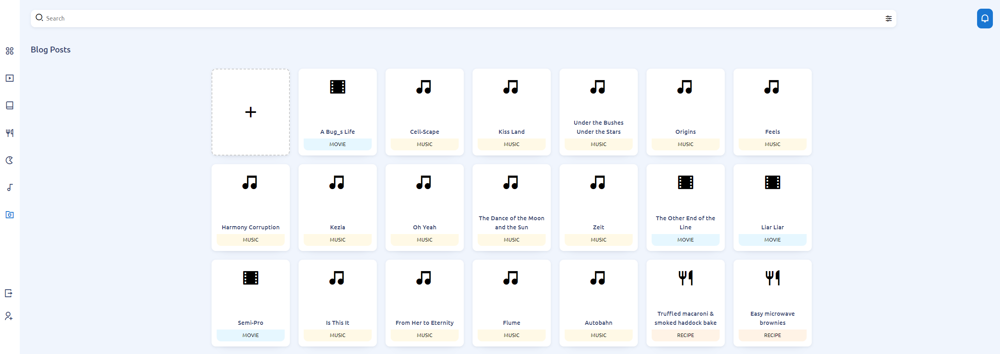
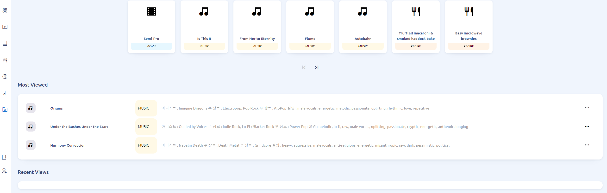
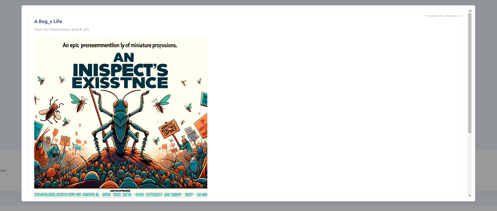

# Demoboard 프로젝트

## 소개

이 프로젝트는 연습 및 포트폴리오 용도의 Spring Boot 애플리케이션으로, 사용자들이 게시물을 작성, 조회 및 상호작용할 수 있는 블로그를 만들었습니다. PostgreSQL을 데이터베이스로 사용하고, Redis를 캐싱용으로 활용하였습니다.

## 프로젝트 소개

- JWT 기반 사용자 인증을 구현
- 게시물 작성, 수정 및 삭제 기능을 개발
- 게시물에 댓글 달기 기능을 추가
- 최근 및 가장 많이 조회된 게시물을 볼 수 있도록 
- 역할 기반 접근 제어를 적용
- Docker 및 Docker Compose를 통합
- 커스텀 에러 처리를 구현
- Redis를 활용한 데이터 캐싱을 도입
- 이미지 업로드 및 관리 기능을 포함
- OpenAI DALL-E를 사용해서 표지 이미지를 생성

<table>
  <tr>
    <td style="text-align: center; width: 33%;">
      
      <p>Index 페이지</p>
    </td>
    <td style="text-align: center; width: 33%;">
      
      <p>Index 하단</p>
    </td>
    <td style="text-align: center; width: 33%;">
      
      <p>게시물 페이지</p>
    </td>
  </tr>
</table>

## 프로젝트 디렉토리 구조

- docker: 여러 도커 파일들을 관리하기 위함입니다.
- images: 프로젝트 내용 소개용 이미지를 모아두었습니다.
    - dall-e-imags: 정해진 프롬프트 템플릿을 사용해서 생성형 AI로 생성한 이미지들입니다.
- logs: 스프링 및 DB 등 로깅 관련 파일들입니다(추후 구현 예정).
- script: 프로젝트 메타데이터(프로젝트 구조 및 endpoint 종류 등)를 쉽게 볼 수 있는 Python 스크립트를 모아두었습니다.
- src: Spring 블로그 프로젝트의 소스 코드입니다.

## 주요 기술 스택

- 스프링 부트를 사용
- PostgreSQL을 데이터베이스로 사용
<<<<<<< HEAD
<<<<<<< HEAD
=======
>>>>>>> a91c944 (README 설명 추가)
  - plpython3u 를 이용해서 sql문 내에서 암호화 적용
- Security JWT를 적용
- Testing: JUnit 5를 사용
- Redis를 데이터 캐싱으로 활용
  - 유저 로그아웃시 : access token 블랙리스트 등록
<<<<<<< HEAD
=======
- Security JWT를 적용
- Testing: JUnit 5를 사용
- Redis를 데이터 캐싱으로 활용
>>>>>>> a4645df (이미지 파일 및 커밋 안된 파일 추가)
=======
>>>>>>> a91c944 (README 설명 추가)
- Docker를 사용
- JPA를 데이터베이스 연동에 사용

## 설정 방법

### 사전 준비

- Docker를 설치
- Docker Compose를 설치
- Java 17 이상을 설치
- Gradle을 설치
- Python3을 설치했습니다(이미지 복사 용도).

### 애플리케이션 실행

1. **레포지토리 클론**:

   ```bash
   git clone https://github.com/chahyoil/demoboard.git
   cd demoboard
   ```

2. **Docker 이미지 빌드**:

   ```bash
   docker-compose build
   ```

3. **서비스 시작**:

   ```bash
   docker-compose up
   ```

4. **컨테이너 내부에 이미지 복사**:

   ```python
   python .\script\move_files.py
   ```

5. **애플리케이션 접근**:

   브라우저를 열고 `http://localhost:8080`으로 이동합니다.

### 데이터베이스 스키마 및 초기화

- 데이터베이스 스키마는 `src/main/resources/1_schema.sql` 파일에 정의
- 데이터베이스 더미 데이터는 `src/main/resources/2_data.sql` 파일에 정의
- 데이터베이스 더미 포스팅 데이터는 `src/main/resources/3_posts.sql` 파일에 정의

### 환경 설정

환경별 설정은 `application.yml`과 `application.properties` 파일에 정의 주요 설정에는 데이터베이스 연결 정보, Redis 설정, JWT 설정 등이 포함되어 있습니다.

## 더미 데이터 생성

### 오픈 데이터셋 사용

1. Kaggle, UCI 기계 학습 저장소 등에서 데이터셋을 다운로드
2. 이 데이터셋을 사용하여 데이터베이스 테이블을 채웠습니다. 예시 카테고리로는 영화, 책, 레시피, 게임(스팀, 모바일, 비디오), 음악 등이 있습니다.

### OpenAI DALL-E를 사용한 이미지 생성

1. 데이터셋의 내용을 기반으로 OpenAI DALL-E를 사용하여 이미지를 생성
2. 생성된 이미지를 저장하고 데이터베이스의 해당 항목과 연결

### 미리 생성해둔 이미지들을 도커 컨테이너 안으로 복사
1. 프로젝트 루트에서 다음의 명령어를 실행
2. python .\script\move_files.py

## TODO 리스트

- [ ] 단위 테스트 및 통합 테스트를 구현
- [ ] JPA N+1 문제를 해결
- [ ] 소스 코드를 리팩토링 및 정리
- [ ] 리액티브 프로그래밍을 추가하여 댓글이 달릴 경우 알림을 표시.
- [ ] 권한 부여 로직 및 등급 업 기능을 추가.
- [ ] 검색 기능을 추가.
- [ ] 더미 데이터를 생성하는 로직/소스를 추가.
- [ ] 로깅 기능을 추가 및 구현.
- [ ] 포스트 조회 시 서버 파일 이름을 숨기고 원본 파일 이름으로

## Docker 및 Docker Compose

이 프로젝트는 Docker 및 Docker Compose 구성을 포함하여 설정 및 배포 과정을 간소화
